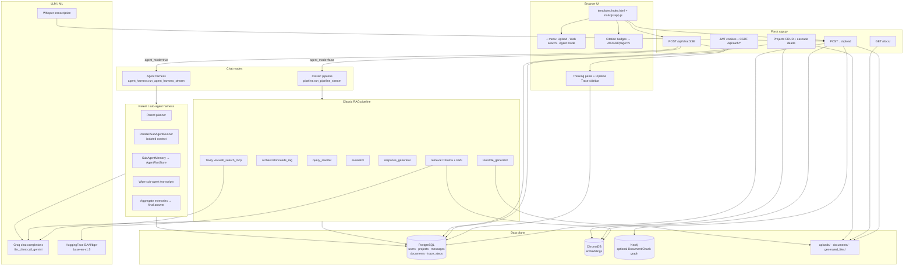

# Agentic RAG Chat

A Flask-based **retrieval-augmented generation (RAG)** chat app with an optional **parent / sub-agent harness**, project-scoped document workspaces, clickable citations, live pipeline traces, and SSE streaming.

---

## Use case

**Problem:** Teams and researchers need answers grounded in *their* PDFs, Word docs, notes, and recordings—not generic LLM guesses—while still seeing *why* an answer was produced (sources, pages, and reasoning steps).

**What this project solves:**

| Need | How the app addresses it |
|------|---------------------------|
| Ask questions over private corpora | Upload PDFs/DOCX/TXT/audio/video; chunks are embedded and retrieved per project or “general” scope |
| Trustworthy answers | Classic RAG path: rewrite → route → retrieve → evaluate → retry → grounded answer with `[Document N]` citations |
| Complex / multi-part tasks | Optional **Agent mode**: a parent planner spawns isolated sub-agents (RAG / web / answer), keeps only compact memories, then aggregates |
| Auditability | Live “Show thinking” + pipeline trace sidebar; steps are **persisted** and replayed when you reopen a chat |
| Source navigation | Citation badges and “Referenced documents” open `/docs/<id>?page=N` (PDF viewer with page jump) |
| Workspace hygiene | Projects group chats + uploads; deleting a project wipes its chats, traces, docs, upload folder, and Chroma chunks |

Typical users: students reviewing clinical/guideline PDFs, engineers querying handbooks, or anyone who wants chat + citations over a local document set.

---

## Architecture diagram



### Request lifecycle (classic path)

1. User sends a message (optional Web search / Agent mode toggles).
2. SSE stream emits `step` events (history, rewrite, retrieval, evaluation, …).
3. Pipeline finishes → optional file generation → user + assistant rows saved → **trace steps bulk-inserted**.
4. Frontend renders answer, citation links, thinking panel, and trace sidebar.

### Request lifecycle (Agent mode)

1. Parent loads history only for planning (snapshot).
2. Planner emits 1–N subtasks (`rag` / `web` / `answer`).
3. Sub-agents run **in parallel** with empty context + scoped tools; each returns a **memory**.
4. Transcripts are **wiped**; parent aggregates memories into the final answer.
5. Same SSE + persistence pattern as classic mode.

---

## Tech stack

### Application & API
| Layer | Choice |
|-------|--------|
| Web framework | **Flask** + Server-Sent Events (SSE) for chat |
| Auth | **Flask-JWT-Extended** (httpOnly cookies) + **bcrypt** + CSRF |
| Frontend | Vanilla JS, Marked, DOMPurify, inline CSS in `templates/index.html` |
| Containers | Docker / docker-compose (Postgres, Neo4j, app) |

### AI / RAG
| Piece | Choice |
|-------|--------|
| Chat LLMs | **Groq** OpenAI-compatible API (`llm_client.py`; models via env, e.g. Llama 3.1/3.3) |
| Orchestration | Custom **agentic pipeline** + optional **`agent_harness`** (parent/sub-agent) — *not* Letta/LangGraph; purpose-built for this app |
| Embeddings | **sentence-transformers** / LangChain HuggingFace: `BAAI/bge-base-en-v1.5` |
| Vector store | **ChromaDB** (LangChain `Chroma`) with project_id metadata filters |
| Retrieval | Semantic + keyword search fused with **Reciprocal Rank Fusion (RRF)** |
| Ingestion | PyMuPDF, Docx2txt, TextLoader; **Whisper** for audio/video |
| File outputs | ReportLab PDF / python-docx generators under `tools/` |

### Data stores
| Store | Role |
|-------|------|
| **PostgreSQL** | Users, projects, conversations, messages, documents, chunks, **trace_steps** |
| **Neo4j** | Optional Document→Chunk graph (write-side; retrieval remains Chroma) |
| Local disk | `uploads/`, `documents/`, `generated_files/`, `chroma_db/` |

### MCP / tools (honest inventory)
| Name | Reality in this repo |
|------|----------------------|
| `web_search_mcp.py` | **Tavily HTTP search** wrapped as a tool class (MCP-style name; **not** the Model Context Protocol wire format on the live chat path) |
| `tools/file_system.py` | Prototype **MCP stdio filesystem** client + older generators — **not wired** into `pipeline` / Agent mode |
| Live “tools” | Imperative Python callables: retrieve, evaluate, Tavily search, `generate_file`, ingest |

If you add real MCP servers later, the harness tool registry (`agent_harness/tools.py`) is the natural extension point.

---

## What makes this project unique

1. **Two chat modes, one UI** — Classic RAG pipeline *or* parent/sub-agent harness via a plus-menu toggle (`agent_mode`), without rewriting retrieval.
2. **Ephemeral sub-agents** — Isolated contexts, compact **memories** only, explicit **wipe** of scratch transcripts after each subtask.
3. **Observable by design** — SSE step stream + persisted `trace_steps` so reopening a conversation restores “Show thinking” / trace sidebar.
4. **Citations that open real files** — Filename/page badges link to a PDF.js-free iframe viewer (`#page=N`) served from DB `file_path` / `documents/`.
5. **Project workspaces** — Scope chats + Chroma filters; cascade delete cleans DB, uploads, and vectors.
6. **Upload UX** — XHR real byte progress drives an SVG ring around the **+** button (plus the existing filename % chip).

---

## Repository map

```
app.py                 # Flask routes, SSE chat, upload, /docs, projects
auth.py                # Register / login / refresh / logout
db.py                  # PostgreSQL schema helpers + CRUD
pipeline.py            # Classic RAG orchestration (untouched by harness)
orchestrator.py        # RAG vs direct router (keyword + LLM)
query_rewriter.py      # Query rewrite + feedback rewrite
retrieval.py           # Chroma load, RRF retrieval
ingestion.py           # Upload/batch ingest → Chroma + DB + Neo4j
response_generator.py  # Direct / grounded / safe answers
evaluator.py           # Relevance judge
llm_client.py          # Groq HTTP client
web_search_mcp.py      # Tavily search tool
graph_store.py         # Neo4j helpers
agent_harness/         # Parent planner, sub-agents, memory, SSE entry
tools/                 # File detect/generate, PDF/DOCX, markdown IR
static/js/app.js       # SPA chat, SSE, citations, upload ring, projects
templates/             # index, viewer, doc
validate_*.py          # Citation + harness unit checks
```

---

## Features checklist

- [x] JWT auth (cookies + CSRF)
- [x] General + project-scoped conversations
- [x] Document upload with live progress ring
- [x] Classic RAG with rewrite / evaluate / retry
- [x] Optional web search (Tavily)
- [x] Optional Agent mode (parallel sub-agents)
- [x] Clickable citations + PDF page viewer
- [x] Pipeline trace UI + DB persistence / reload
- [x] Generated PDF/DOCX/TXT/MD downloads
- [x] Project delete with cascade (chats, traces, docs, files, Chroma)

---

## Quick start

### Prerequisites
- Python 3.11+
- PostgreSQL
- Optional: Neo4j, Tavily API key, Docker

### Environment

Create a `.env` in the project root (example keys):

```env
# Database
DB_HOST=localhost
DB_NAME=your_db
DB_USER=your_user
DB_PASSWORD=your_password

# LLM (Groq)
GROQ_API_KEY=...
GROQ_BASE_URL=https://api.groq.com/openai/v1/chat/completions
ORCHESTRATOR_MODEL=llama-3.1-8b-instant
REWRITER_MODEL=llama-3.1-8b-instant
EVALUATOR_MODEL=llama-3.1-8b-instant
RESPONSE_MODEL=llama-3.3-70b-versatile

# Optional
TAVILY_API_KEY=...
NEO4J_URI=bolt://localhost:7687
NEO4J_USERNAME=neo4j
NEO4J_PASSWORD=...
JWT_SECRET_KEY=change-me
FLASK_SECRET_KEY=change-me

# Agent harness caps (optional)
MAX_SUBAGENTS=3
MAX_SUBAGENT_STEPS=4
SUBAGENT_TIMEOUT_SEC=60
```

> Note: `db.py` currently reads `DB_PASSWORD` with `int(...)`. Use a numeric password or adjust that line for string passwords.

### Run locally

```bash
python -m venv .venv
# Windows
.\.venv\Scripts\activate
pip install -r requirements.txt   # if present in your checkout

# Ensure Postgres is up and core tables (users, conversations, messages) exist
python app.py
```

Open `http://127.0.0.1:5000` → register / login → create a project or use general chats → upload docs → ask questions.

**Agent mode:** open **+** → enable **Agent mode** (and optionally **Web search**) → send a multi-part question → inspect sub-agent memories in the thinking / trace panels.

### Docker

```bash
docker compose up --build
```

See `dockerfile`, `docker-compose.yaml`, and `Entrypoint.sh`. Compose expects a `migrations.sql` for first-time Postgres init (may be gitignored in some checkouts); `db.ensure_*` helpers create many app tables at runtime.

---

## API surface (high level)

| Method | Path | Purpose |
|--------|------|---------|
| POST | `/api/auth/register` | Create account |
| POST | `/api/auth/login` | Set JWT cookies |
| POST | `/api/chat` | SSE chat (`web_search`, `agent_mode` flags) |
| POST | `/api/conversations/<id>/upload` | Ingest a file |
| GET | `/api/conversations/<id>/messages` | History + restored `trace` |
| GET/POST | `/api/projects` | List / create projects |
| DELETE | `/api/projects/<id>` | Cascade-delete project |
| GET | `/docs/<id>?page=N` | View source PDF page |
| GET | `/download/generated/<file>` | Download generated files |
| GET | `/api/health` | Health + vectorstore flag |

---

## Testing helpers

```bash
python validate_citations.py      # RRF + citation map / URL checks
python validate_agent_harness.py  # Memory store, wipe, planner caps
```

---

## Configuration tips

| Concern | Tip |
|---------|-----|
| Batch docs in `documents/` | Run ingestion / `load_docs` so filenames register in Postgres; UI uploads set `document_id` automatically |
| Citations not clickable | Prefer upload path or ensure `document_id` / filename exists in `documents` |
| Agent mode empty plan | Planner falls back to a single RAG (+ web if toggle on) subtask |
| Delete project 404 | Restart Flask after pulling DELETE route; ensure numeric project id in Network tab |

---

## License / status

Internal / coursework-style Agentic RAG demo. Extend at your own risk; Neo4j and Tavily are optional for core RAG chat.

---

## Credits

Built as an **agentic RAG** system: classic retrieve–evaluate–generate loop, plus a lightweight **parent/sub-agent harness**, Groq-hosted LLMs, Chroma retrieval, and a Flask SSE UI with durable traces and source-linked citations.
